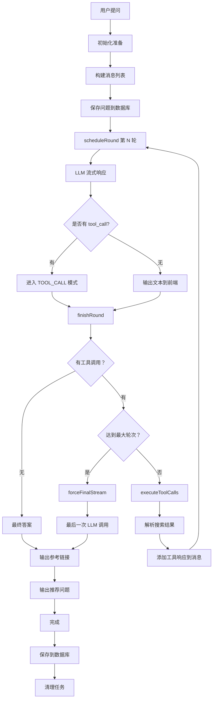

# WebSearchReactAgent 执行流程详解

## 一、启动阶段：从用户提问开始

当用户发起一个问题时，整个系统按以下流程执行：

### 1. 入口调用

```java
// 外部调用方式
agent.execute(conversationId, question);
// 或
agent.stream(conversationId, question);
```

这两个方法最终都会调用核心方法 `streamInternal()`。

---

## 二、初始化与准备阶段

### 步骤 1：检查任务状态

```java
Flux<String> checkResult = checkRunningTask(conversationId);
if (checkResult != null) {
    return checkResult;  // 如果该会话已有任务在执行，直接返回
}
```

**目的**：防止同一个会话 ID 同时执行多个任务。

### 步骤 2：创建异步流通道

```java
Sinks.Many<String> sink = Sinks.many().unicast().onBackpressureBuffer();
```

**作用**：创建一个单生产者、多消费者的背压缓冲队列，用于后续流式输出。

### 步骤 3：注册任务到管理器

```java
AgentTaskManager.TaskInfo taskInfo = registerTask(conversationId, sink);
```

**目的**：让任务管理器知道当前有一个新任务在运行，便于后续取消或停止。

### 步骤 4：构建消息列表（核心上下文）

```java
List<Message> messages = Collections.synchronizedList(new ArrayList<>());

// 4.1 添加系统提示词（固定模板）
messages.add(new SystemMessage(ReactAgentPrompts.getWebSearchPrompt()));

// 4.2 添加自定义系统提示（如果有）
if (StringUtils.isNotBlank(systemPrompt)) {
    messages.add(new SystemMessage(systemPrompt));
}

// 4.3 加载历史对话记忆
loadChatHistory(conversationId, messages, true, true);

// 4.4 添加当前用户问题
messages.add(new UserMessage("<question>" + question + "</question>"));
```

**消息列表结构**：

```
[SystemMessage(通用提示), SystemMessage(自定义提示), 
 UserMessage(历史对话 1), UserMessage(历史回答 1), ..., 
 UserMessage(当前问题)]
```

### 步骤 5：保存问题到数据库

```java
AiSession savedSession = sessionService.saveQuestion(
    SaveQuestionRequest.builder()
        .sessionId(conversationId)
        .question(question)
        .build()
);
currentSessionId = savedSession.getId();
```

**目的**：记录用户提问，生成会话 ID，用于后续保存答案。

---

## 三、ReAct 推理循环阶段

### 核心变量准备

```java
AtomicLong roundCounter = new AtomicLong(0);           // 轮次计数器
AtomicBoolean hasSentFinalResult = new AtomicBoolean(false);  // 完成标记
StringBuilder finalAnswerBuffer = new StringBuilder();  // 最终答案缓存
StringBuilder thinkingBuffer = new StringBuilder();     // 思考过程缓存
AgentState agentState = new AgentState();              // Agent 全局状态
```

### 启动第一轮推理

```java
scheduleRound(messages, sink, roundCounter, hasSentFinalResult, 
              finalAnswerBuffer, useMemory, conversationId, 
              agentState, thinkingBuffer);
```

---

## 四、单轮推理执行流程（scheduleRound）

### 步骤 1：轮次计数

```java
roundCounter.incrementAndGet();  // 第 1 轮、第 2 轮...
RoundState state = new RoundState();  // 本轮的状态对象
```

### 步骤 2：向 LLM 发起请求

```java
Disposable disposable = chatClient.prompt()
    .messages(messages)      // 发送完整的消息历史
    .stream()                // 流式响应
    .chatResponse()
    .publishOn(Schedulers.boundedElastic())  // 异步执行
    .doOnNext(chunk -> processChunk(chunk, sink, state))  // 处理每个响应块
    .doOnComplete(() -> finishRound(...))   // 响应完成后的处理
    .subscribe();
```

**关键点**：

- 每次请求都带上完整的消息历史（包括之前的工具调用结果）
- 使用流式接收 LLM 的响应
- 异步执行，不阻塞主线程

---

## 五、LLM 响应处理流程（processChunk）

LLM 的响应是逐步返回的，`processChunk` 负责处理每个响应块：

### 情况 A：LLM 决定调用工具

```java
List<AssistantMessage.ToolCall> tc = gen.getOutput().getToolCalls();
if (tc != null && !tc.isEmpty()) {
    state.mode = RoundMode.TOOL_CALL;  // 标记本轮为工具调用模式
    
    for (AssistantMessage.ToolCall incoming : tc) {
        mergeToolCall(state, incoming);  // 合并工具调用参数
    }
    return;  // 不再处理文本
}
```

**示例场景**：

- 用户问"2026 年 AI 技术趋势"
- LLM 分析后认为需要搜索信息
- 返回 tool_call：`{name: "tavily_search", arguments: {"query": "2026 AI 技术趋势"}}`

### 情况 B：LLM 直接输出文本

```java
String text = gen.getOutput().getText();
if (text != null) {
    sink.tryEmitNext(createTextResponse(text));  // 发送给前端
    state.textBuffer.append(text);               // 缓存到本轮状态
}
```

**示例场景**：

- 经过前几轮的工具调用，信息已收集完整
- LLM 开始总结并输出最终答案

---

## 六、轮次结束处理（finishRound）

当 LLM 的完整响应接收完毕后，进入此方法：

### 判断 1：是否调用了工具？

#### 路径 A：没有工具调用 → 最终答案

```java
if (state.getMode() != RoundMode.TOOL_CALL) {
    // 1. 输出参考链接（如果有搜索结果）
    if (!agentState.searchResults.isEmpty()) {
        sink.tryEmitNext(createReferenceResponse(...));
    }
    
    // 2. 输出推荐问题（如果启用）
    if (enableRecommendations) {
        sink.tryEmitNext(createRecommendResponse(...));
    }
    
    // 3. 标记完成
    sink.tryEmitComplete();
    hasSentFinalResult.set(true);
    return;
}
```

#### 路径 B：有工具调用 → 执行工具

```java
// 1. 将工具调用添加到消息历史
AssistantMessage assistantMsg = AssistantMessage.builder()
    .toolCalls(state.toolCalls).build();
messages.add(assistantMsg);

// 2. 检查是否超过最大轮次
if (maxRounds > 0 && roundCounter.get() >= maxRounds) {
    forceFinalStream(...);  // 强制结束
    return;
}

// 3. 执行工具调用
executeToolCalls(sink, state.toolCalls, messages, 
                hasSentFinalResult, state, agentState, () -> {
    // 4. 所有工具执行完成后，进入下一轮
    if (!hasSentFinalResult.get()) {
        scheduleRound(...);  // 递归调用
    }
});
```

---

## 七、工具执行流程（executeToolCalls）

### 步骤 1：并行执行所有工具

```java
for (AssistantMessage.ToolCall tc : toolCalls) {
    Schedulers.boundedElastic().schedule(() -> {
        // 每个工具在独立线程中执行
    });
}
```

### 步骤 2：单个工具的执行逻辑

```java
String toolName = tc.name();
String argsJson = tc.arguments();

// 1. 找到对应的工具实现
ToolCallback callback = findTool(toolName);

// 2. 如果是搜索工具，发送"正在搜索"提示
if (toolName.contains("search")) {
    sink.tryEmitNext(createThinkingResponse("🔍 正在搜索..."));
}

// 3. 执行工具
Object result = callback.call(argsJson);

// 4. 创建工具响应消息
ToolResponseMessage.ToolResponse tr = new ToolResponseMessage.ToolResponse(
    tc.id(), toolName, result.toString());
messages.add(ToolResponseMessage.builder().responses(List.of(tr)).build());

// 5. 记录使用的工具
recordUsedTool(toolName);

// 6. 解析搜索结果（如果是 tavily 搜索）
if (toolName.contains("tavily")) {
    parseSearchResult(result.toString(), agentState);
}
```

### 步骤 3：等待所有工具完成

```java
AtomicInteger completedCount = new AtomicInteger(0);
int current = completedCount.incrementAndGet();
if (current >= total) {
    onComplete.run();  // 所有工具执行完毕，触发回调
}
```

---

## 八、搜索结果解析（parseSearchResult）

当执行 `tavily_search` 工具后，返回的 JSON 需要解析：

```java
JsonNode root = MAPPER.readTree(resultJson);
JsonNode first = root.get(0);  // 取第一个搜索结果
JsonNode textNode = first.get("text");

// 解析嵌套的 JSON 字符串
JsonNode textJson = MAPPER.readTree(textNode.asText());
JsonNode results = textJson.get("results");

// 提取每条结果的 URL、标题、内容
for (JsonNode item : results) {
    String url = getSafe(item, "url");
    String title = getSafe(item, "title");
    String content = getSafe(item, "content");
    
    state.searchResults.add(new SearchResult(url, title, content));
}
```

**解析后的数据结构**：

```
AgentState.searchResults = [
    SearchResult(url="https://...", title="AI 趋势", content="..."),
    SearchResult(url="https://...", title="2026 技术", content="...")
]
```

---

## 九、强制结束流程（forceFinalStream）

当达到最大轮次（如 `maxRounds=5`）时，强制执行：

### 步骤 1：重构消息列表

```java
List<Message> newMessages = new ArrayList<>();

// 保留系统提示
newMessages.add(new SystemMessage(ReactAgentPrompts.getWebSearchPrompt()));
if (StringUtils.isNotBlank(systemPrompt)) {
    newMessages.add(new SystemMessage(systemPrompt));
}

// 保留原有对话（跳过系统消息）
for (Message msg : messages) {
    if (!(msg instanceof SystemMessage)) {
        newMessages.add(msg);
    }
}

// 添加限制提示
newMessages.add(new UserMessage("""
    你已达到最大推理轮次限制。
    请基于当前已有的上下文信息，
    直接给出最终答案。
    禁止再调用任何工具。
    """));

messages.clear();
messages.addAll(newMessages);
```

### 步骤 2：最后一次 LLM 调用

```java
chatClient.prompt()
    .messages(messages)
    .stream()
    .chatResponse()
    .doOnNext(chunk -> {
        String text = chunk.getResult().getOutput().getText();
        sink.tryEmitNext(createTextResponse(text));
    })
    .doOnComplete(() -> {
        // 输出参考链接和推荐问题
        sink.tryEmitComplete();
        hasSentFinalResult.set(true);
    });
```

---

## 十、流式输出与结果保存

### 流式输出的数据处理

```java
return sink.asFlux()
    .doOnNext(chunk -> {
        recordFirstResponse();  // 记录首次响应时间
        
        // 解析 JSON 块，区分类型
        JSONObject json = JSON.parseObject(chunk);
        String type = json.getString("type");
        
        if ("text".equals(type)) {
            finalAnswerBuffer.append(json.getString("content"));
        } else if ("thinking".equals(type)) {
            thinkingBuffer.append(json.getString("content"));
        }
    })
```

**输出的数据类型**：

- `type=text`：最终答案内容
- `type=thinking`：思考过程（如"🔍 正在搜索..."）
- `type=reference`：参考链接（JSON 格式）
- `type=recommend`：推荐问题（JSON 格式）

### 流结束时保存结果

```java
.doFinally(signalType -> {
    // 1. 日志记录
    log.info("最终答案：{}", finalAnswerBuffer);
    log.info("思考过程：{}", thinkingBuffer);
    
    // 2. 保存到数据库
    saveSessionResult(conversationId, finalAnswerBuffer, 
                     thinkingBuffer, agentState);
    
    // 3. 清理任务
    taskManager.stopTask(conversationId);
});
```

### 保存的内容

```java
UpdateAnswerRequest request = UpdateAnswerRequest.builder()
    .id(currentSessionId)
    .answer(finalAnswerBuffer.toString())      // 最终答案
    .thinking(thinkingBuffer.toString())       // 思考过程
    .tools(getUsedToolsString())               // 使用的工具列表
    .reference(referenceJson)                  // 参考链接 JSON
    .recommend(currentRecommendations)         // 推荐问题
    .firstResponseTime(firstResponseTime)      // 首响时间
    .totalResponseTime(totalResponseTime)      // 总响应时间
    .build();

sessionService.updateAnswer(request);
```

---

## 十一、完整执行流程图



---

## 十二、关键设计要点

### 1. **消息历史的累积机制**

每一轮的消息列表变化：

```
第 1 轮：[System, User_Q1, Assistant_toolcall, ToolResponse]
第 2 轮：[System, User_Q1, Assistant_toolcall, ToolResponse, 
         User_Q1, Assistant_toolcall, ToolResponse]
第 3 轮：[System, User_Q1, Assistant_toolcall, ToolResponse, 
         User_Q1, Assistant_toolcall, ToolResponse,
         User_Q1, Assistant_text]  ← 最终答案
```

### 2. **工具调用的并行执行**

```java
// 如果 LLM 同时调用 3 个工具，它们会并行执行
for (ToolCall tc : toolCalls) {
    Schedulers.boundedElastic().schedule(() -> {
        callback.call(argsJson);  // 并行执行
    });
}
```

### 3. **原子变量的线程安全控制**

```java
AtomicBoolean hasSentFinalResult;  // 防止重复发送完成信号
AtomicLong roundCounter;           // 轮次计数（线程安全）
AtomicInteger completedCount;      // 工具完成计数
```

### 4. **响应式流的背压处理**

```java
Sinks.Many<String> sink = Sinks.many().unicast().onBackpressureBuffer();
```

- 支持背压缓冲，避免消费者处理不过来时丢失数据
- 单生产者（Agent）、多消费者（可能有多个订阅者）

---

## 十三、类的核心字段说明

| 字段名 | 类型 | 说明 |
|--------|------|------|
| `chatClient` | ChatClient | Spring AI 聊天客户端 |
| `tools` | List\<ToolCallback\> | 可用工具集合（如搜索引擎） |
| `systemPrompt` | String | 系统提示词 |
| `maxRounds` | int | 最大推理轮次 |
| `advisors` | List\<Advisor\> | 聊天顾问（用于增强功能） |
| `maxReflectionRounds` | int | 最大反思轮次 |
| `chatMemory` | ChatMemory | 聊天记忆存储（继承自 BaseAgent） |
| `sessionService` | AiSessionService | 会话服务（继承自 BaseAgent） |
| `taskManager` | AgentTaskManager | 任务管理器（继承自 BaseAgent） |

---

## 十四、Builder 模式构建示例

```java
WebSearchReactAgent agent = WebSearchReactAgent.builder()
    .name("web-search-agent")
    .chatModel(chatModel)                    // 必须：LLM 模型
    .tools(searchTool, weatherTool)          // 必须：可用工具
    .systemPrompt("你是一个助手")             // 可选：自定义提示
    .maxRounds(5)                            // 可选：最大轮次
    .chatMemory(chatMemory)                  // 可选：记忆存储
    .sessionService(sessionService)          // 可选：会话服务
    .taskManager(taskManager)               // 可选：任务管理
    .advisors(advisor)                       // 可选：顾问
    .build();
```

---

通过这个执行流程，你可以看到整个 Agent 系统是如何像"人类思考"一样工作：**提问 → 分析 → 查资料 → 再分析 → 再查资料 → 总结答案**。这就是 ReAct（Reasoning + Acting）模式的核心思想！
